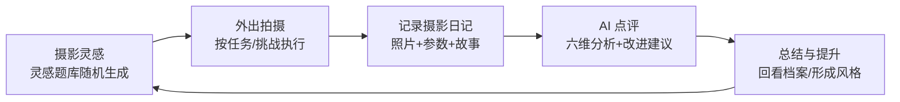
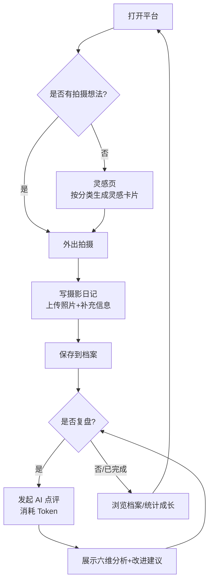

# 个人摄影记录与成长平台 —— 项目文档

> 文档用途：供 Codex 及后续开发者理解项目全貌并据此开发
> 文档版本：v0.1（2026-09-21）
> 项目状态：需求与方案初稿，含待确认决策项（见第十一章）

***

## 一、项目概述

### 1.1 一句话定位

一个面向摄影爱好者的**个人摄影记录与成长平台**：以摄影日记沉淀作品档案，以灵感题库提供拍摄方向，以 AI 点评实现拍摄复盘，最终形成「摄影灵感 → 外出拍摄 → 记录摄影日记 → AI 点评 → 总结与提升」的完整成长闭环。

### 1.2 项目背景

* 摄影爱好者拍摄了大量照片，但缺少系统化整理：照片散落、器材参数丢失、拍摄时的想法与故事随记忆淡忘。

* 创作枯竭时没有获得拍摄方向的机制，容易停滞。

* 缺少复盘手段，难以客观理解照片的优点与不足，成长缓慢。

### 1.3 核心价值

1. **结构化沉淀**：把零散照片整理为可检索的个人摄影档案（时间 / 地点 / 器材 / 主题 / 标签 / 故事）。

2. **持续启发**：通过预设摄影题库随机生成拍摄任务，解决 "没东西可拍"。

3. **AI 辅助复盘**：多模态 AI 从专业维度点评照片，给出具体改进建议，帮助提升摄影能力。

4. **关注过程而非展示**：与普通作品展示网站不同，本平台聚焦拍摄过程与长期积累，逐步形成个人摄影风格。

### 1.4 目标用户与使用场景

* 个人摄影爱好者，以个人使用为主。

* 典型场景：

* 外出拍摄前：浏览 / 生成灵感，获取拍摄方向。

* 拍摄后：在摄影日记中记录作品与拍摄信息、想法。

* 空闲时：浏览档案、发起 AI 点评、复盘提升。

***

## 二、核心功能需求

### 2.1 摄影日记（记录）

用户记录自己拍摄的作品，为照片补充完整的拍摄上下文，形成结构化个人档案。

**功能点：**

* 上传照片（照片资源存储于阿里云 OSS，前端负责展示与管理）。

* 为每张照片补充以下信息：

* **拍摄时间**：拍摄日期（及可选的具体时刻）。

* **拍摄地点**：地点名称（可选附带经纬度坐标，用于地图维度检索）。

* **器材参数**：相机机身、镜头、焦距、光圈、快门速度、ISO（字段可扩展）。

* **摄影主题**：本次拍摄的主题 / 题材（如 "街头光影"" 海边日落 "）。

* **标签**：自定义标签，支持多标签。

* **想法与故事**：拍摄时的想法、经历、故事等自由文本。

* 浏览与检索：按时间线、地点、器材、主题、标签等维度筛选与检索作品。

* 编辑与删除：支持修改已记录的日记内容。

### 2.2 摄影灵感（灵感生成）

为缺乏拍摄想法的用户提供创作方向。**不依赖大模型**，通过预设摄影题库随机生成拍摄任务。

**功能点：**

* 题库按主题分类：**街头、风景、人像、建筑、夜景、光影** 等。

* 每张 "灵感卡片" 包含以下要素：

* **拍摄主题 / 任务描述**：一句话给出可执行拍摄任务。

* **拍摄风格**：建议的拍摄风格（如黑白纪实、极简、冷暖对比等）。

* **难度等级**：如 1–5 级，供用户按水平选择。

* **构图建议**：构图方向建议（如三分法、框架构图、引导线等）。

* **挑战条件**：额外挑战项，增加趣味（如 "只用 35mm 定焦"" 只拍剪影 "）。

* 交互：

* 随机生成一张灵感卡片（可 "换一张"）。

* 按分类筛选后生成。

* 可标记 "已完成 / 想拍"，避免短期内重复推荐（去重逻辑）。

* 可收藏灵感，作为待拍清单。

### 2.3 AI 摄影点评（复盘）

用户主动选择自己的照片交给多模态 AI，从专业维度分析并给出改进建议，实现拍摄后的复盘。

**功能点：**

* 用户从作品档案中主动选择照片发起点评（**仅在用户主动发起时调用 AI**，用于控制 Token 消耗）。

* AI 分析维度（六个维度）：
1. **构图**：画面布局、平衡、主体位置等。

2. **光线**：光的方向、质量、曝光处理等。

3. **色彩**：色彩搭配、色调、白平衡等。

4. **主体表达**：主体是否突出、情绪与意图传达。

5. **画面叙事**：照片讲述的故事、信息层次。

6. **技术完成度**：对焦、清晰度、噪点、后期等。
* 输出内容：

* 各维度简评（可含评分或等级）。

* 整体亮点（做得好的地方）。

* 主要不足。

* **具体可执行的改进建议**。

* 综合评语。

* 点评结果随日记存档，可随时回看。

* 支持单张照片点评（必要时可支持同一日记内多图逐张点评）。

### 2.4 作品档案浏览

* 画廊式网格浏览全部作品。

* 筛选：时间、地点、器材、主题、标签、是否已点评。

* 照片详情页：完整展示日记信息 + AI 点评结果。

* 照片加载需做懒加载与缩略图优化（见第九章）。

***

## 三、用户流程与成长闭环

整体闭环（核心产品逻辑）：



详细操作流：



***

## 四、系统架构

### 4.1 总体架构

**核心原则：不引入传统后端服务**。前端负责摄影日记、灵感题库、作品浏览等主要功能；仅通过轻量 Serverless 服务处理 AI 接口密钥和云存储授权等敏感操作。

```mermaid
flowchart TB
    subgraph Browser[浏览器端 - 纯前端 SPA]
        UI[前端应用<br/>日记/灵感/浏览/点评]
        IDB[(本地存储 IndexedDB<br/>日记数据/灵感题库/点评记录)]
    end

    subgraph Cloud[云服务]
        OSS[(阿里云 OSS<br/>照片存储)]
        SL[轻量 Serverless<br/>①签发 STS 临时凭证<br/>②AI 点评代理(持有密钥)]
    end

    AI[多模态 AI 大模型 API]

    UI -- 直传照片(临时凭证) --> OSS
    UI -- 请求 STS / 调用 AI 点评 --> SL
    SL -- 转发图片与点评请求 --> AI
    UI <--> IDB
```

### 4.2 架构说明

| 组件            | 职责                                                          | 说明                            |
| ------------- | ----------------------------------------------------------- | ----------------------------- |
| 前端应用          | 摄影日记、灵感题库、作品浏览、AI 点评交互、本地数据读写                               | 纯前端 SPA，无传统后端依赖               |
| 阿里云 OSS       | 照片资源的存储与静态访问                                                | 前端直传；敏感操作（授权）下沉 Serverless    |
| Serverless    | ① 签发 STS 临时凭证供前端直传 OSS；② 作为 AI 点评代理，持有 AI API Key，转发请求并返回结果 | 密钥只存在于 Serverless 环境变量，绝不下发前端 |
| 多模态 AI API    | 对照片做六维点评分析                                                  | 仅在用户主动发起点评时调用                 |
| IndexedDB（本地） | 存储日记结构化数据、灵感题库、AI 点评记录                                      | 个人单机使用，无需账号体系                 |

### 4.3 设计决策记录

| 决策       | 方案                       | 理由                      |
| -------- | ------------------------ | ----------------------- |
| 无传统后端    | 纯前端 + Serverless         | 个人使用，降低开发与运维成本          |
| 照片存储     | 阿里云 OSS（前端直传 + STS 临时凭证） | 大文件不适合进本地存储；直传避免流量经过服务端 |
| AI 密钥保护  | 密钥仅存 Serverless 环境变量     | 避免前端暴露密钥被滥用             |
| 应用数据存储   | 浏览器 IndexedDB            | 个人单机使用；后续如需多端同步再扩展      |
| Token 控制 | 仅用户主动发起点评时调用 AI；点评前压缩图片  | 控制成本                    |

***

## 五、技术栈建议

> 以下为建议选型，最终以确认结果为准（见第十一章待确认项）。

| 层          | 建议方案                                  | 备注 / 备选                         |
| ---------- | ------------------------------------- | ------------------------------- |
| 前端框架       | Vue 3 + Vite                          | 备选：React + Vite                 |
| 路由         | Vue Router                            | React 对应 React Router           |
| 状态管理       | Pinia                                 | React 对应 Zustand                |
| UI 组件库     | Element Plus（可选）                      | 也可自研轻量组件，保持简洁                   |
| 本地存储封装     | Dexie.js（IndexedDB 封装）                | 简化 CRUD                         |
| 图片懒加载      | IntersectionObserver 或组件库懒加载          | 档案页性能                           |
| OSS 上传     | ali-oss 浏览器端 SDK + STS 临时凭证           | 直传 OSS                          |
| Serverless | 阿里云函数计算 FC（推荐，与 OSS 同生态）              | 备选：Cloudflare Workers / 腾讯云 SCF |
| AI 多模态模型   | 豆包（doubao-vision）/ 通义千问 VL / GPT-4o 类 | 需支持图片输入 + 结构化输出，待确认             |
| 静态部署       | 静态托管（Vercel / Netlify / OSS 静态网站托管等）  | 建议站点与照片存储分离（不同 bucket 或子目录）     |

***

## 六、数据模型设计

### 6.1 摄影日记（PhotoEntry）

| 字段                        | 类型                 | 说明                    |
| ------------------------- | ------------------ | --------------------- |
| `id`                      | string             | 唯一 ID                 |
| `title`                   | string             | 作品标题（可选）              |
| `images`                  | string\[]          | 照片 OSS URL 列表（支持一稿多图） |
| `takenAt`                 | string             | 拍摄时间（ISO 日期 / 时间）     |
| `location.name`           | string             | 拍摄地点名称                |
| `location.coords`         | {lat, lng} \| null | 经纬度（可选）               |
| `equipment.camera`        | string             | 相机机身                  |
| `equipment.lens`          | string             | 镜头                    |
| `equipment.focalLength`   | string             | 焦距（如 35mm）            |
| `equipment.aperture`      | string             | 光圈（如 f/2.8）           |
| `equipment.shutterSpeed`  | string             | 快门速度（如 1/125s）        |
| `equipment.iso`           | string             | ISO                   |
| `theme`                   | string             | 摄影主题                  |
| `tags`                    | string\[]          | 自定义标签                 |
| `story`                   | string             | 拍摄想法与故事               |
| `reviewId`                | string \| null     | 关联的 AI 点评记录 ID        |
| `createdAt` / `updatedAt` | string             | 创建 / 更新时间             |

> 器材参数字段建议做成可配置的固定集合，保持录入一致性。

### 6.2 灵感卡片（InspirationCard）

| 字段            | 类型     | 说明                             |
| ------------- | ------ | ------------------------------ |
| `id`          | string | 唯一 ID                          |
| `category`    | enum   | 分类：街头 / 风景 / 人像 / 建筑 / 夜景 / 光影 |
| `task`        | string | 拍摄主题 / 任务描述                    |
| `style`       | string | 建议拍摄风格                         |
| `difficulty`  | number | 难度 1–5                         |
| `composition` | string | 构图建议                           |
| `challenge`   | string | 挑战条件（可为空）                      |
| `status`      | enum   | 未拍 / 想拍（收藏）/ 已完成               |
| `createdAt`   | string | 创建时间                           |

> 题库为预设数据（纯前端内置或本地存储），不依赖大模型。建议初始每个分类不少于 20 条，可后续扩充。

### 6.3 AI 点评（AIPhotoReview）

| 字段            | 类型        | 说明                                                   |
| ------------- | --------- | ---------------------------------------------------- |
| `id`          | string    | 唯一 ID                                                |
| `entryId`     | string    | 关联的摄影日记 ID                                           |
| `imageUrl`    | string    | 被点评的照片 URL                                           |
| `dimensions`  | object    | 六维简评：构图 / 光线 / 色彩 / 主体表达 / 画面叙事 / 技术完成度（每条含评语，可选含评分） |
| `strengths`   | string\[] | 整体亮点                                                 |
| `weaknesses`  | string\[] | 主要不足                                                 |
| `suggestions` | string\[] | 具体改进建议                                               |
| `summary`     | string    | 综合评语                                                 |
| `model`       | string    | 使用的模型标识                                              |
| `createdAt`   | string    | 点评时间                                                 |

> AI 点评建议要求模型输出
> 
> **结构化 JSON**
> 
> ，前端直接渲染并本地存档，便于回看与统计。

### 6.4 IndexedDB 存储设计（建议）

| Object Store   | Key  | 内容              |
| -------------- | ---- | --------------- |
| `entries`      | `id` | 摄影日记            |
| `inspirations` | `id` | 灵感卡片（题库 + 生成记录） |
| `reviews`      | `id` | AI 点评记录         |

* 索引：`entries` 按 `takenAt`、`tags`、`theme` 建立索引便于筛选。

* 提供数据导出（JSON 备份）与导入能力（见第九章）。

***

## 七、页面结构与路由（建议）

| 路由                | 页面        | 主要功能                  |
| ----------------- | --------- | --------------------- |
| `/`               | 首页 / 档案画廊 | 全部作品网格浏览、筛选、检索        |
| `/entry/:id`      | 日记详情      | 照片大图、完整日记信息、AI 点评展示   |
| `/entry/new`      | 写日记       | 上传照片 + 填写拍摄信息表单       |
| `/entry/:id/edit` | 编辑日记      | 修改既有日记                |
| `/inspire`        | 灵感页       | 分类浏览、随机生成灵感卡片、收藏 / 标记 |
| `/review/:id`     | AI 点评页    | 选择照片发起点评、展示六维分析结果     |
| `/stats`（可选）      | 成长统计      | 拍摄量趋势、分类分布、点评历史（扩展项）  |

***

## 八、关键流程实现说明

### 8.1 照片上传（OSS 直传）

```
1\. 前端请求 Serverless 的 STS 接口，获取临时凭证（AccessKeyId / SecurityToken / 过期时间）。

2\. 前端使用 ali-oss SDK + 临时凭证，将照片直传 OSS 指定目录（如 photos/YYYY/MM/）。

3\. 上传成功后将 OSS URL 存入日记 images 字段。

4\. OSS Bucket 建议私有；展示时通过签名 URL 或 Bucket 策略控制读取权限。
```

安全要点：

* STS 凭证只授予最小权限（仅允许上传到当前用户的前缀目录）。

* Serverless 端持有主账号 AccessKey 用于签发 STS，密钥不下发前端。

* 限制上传文件类型与大小（如 jpg/png/webp，单张 ≤ 20MB），前后端双重校验。

### 8.2 AI 点评调用

```
1\. 用户在作品档案中选择照片，点击"AI 点评"。

2\. 前端将照片（压缩后）发送至 Serverless 点评接口。

3\. Serverless 读取环境变量中的 AI API Key，调用多模态 AI 模型。

4\. 模型返回结构化 JSON（六维评语 + 亮点 + 不足 + 建议 + 综合评语）。

5\. 前端渲染点评结果，并保存为 AIPhotoReview 记录，关联到日记。

6\. 同一照片可再次点评（覆盖或追加历史，建议保留历史版本）。
```

Token 控制措施：

* 仅用户主动发起时调用。

* 上传点评前前端压缩图片（如限制最长边 ≤ 2048px，压缩质量 0.85）。

* 可提示用户点评消耗额度，避免高频误触。

### 8.3 灵感生成逻辑

* 从题库中按所选分类（或全部分类）随机抽取卡片。

* 去重：排除近期已生成 / 已标记完成的卡片，避免重复推荐。

* 卡片展示：主题、风格、难度、构图建议、挑战条件。

* 用户操作：换一张 / 收藏（想拍）/ 标记完成。

***

## 九、非功能需求

| 类别        | 要求                                                                         |
| --------- | -------------------------------------------------------------------------- |
| **成本控制**  | AI 仅在主动点评时调用；图片压缩后再送评；Serverless 轻量计费                                      |
| **安全**    | AI API Key 与云账号 AccessKey 仅存 Serverless 环境变量；STS 最小权限；CORS 白名单；上传类型 / 大小限制 |
| **隐私**    | 个人使用，照片默认不对外公开；OSS 私有 + 签名 URL 或受控读取                                       |
| **性能**    | 画廊页缩略图 + 懒加载；详情页大图按需加载；本地存储读写轻量                                            |
| **数据可靠性** | 支持一键导出 JSON 备份 / 导入恢复；防止误删（删除二次确认）                                         |
| **兼容性**   | 桌面端为主，建议响应式适配移动端浏览                                                         |

***

## 十、开发里程碑（建议拆解）

| 里程碑            | 内容                                  | 验收要点              |
| -------------- | ----------------------------------- | ----------------- |
| **M0 脚手架**     | 前端工程初始化、路由框架、基础布局、设计基调              | 项目可运行，页面骨架完整      |
| **M1 照片上传链路**  | Serverless STS 签发 + OSS 直传 + 图片展示   | 上传成功且可回显；密钥未出现在前端 |
| **M2 摄影日记与档案** | 日记 CRUD、画廊浏览、多维筛选、详情页               | 可完整记录与检索          |
| **M3 灵感题库**    | 题库数据、随机生成、分类筛选、收藏 / 完成状态            | 各分类可生成不重复灵感卡片     |
| **M4 AI 点评**   | Serverless AI 代理 + 前端点评交互 + 结果展示与存档 | 六维点评完整展示并持久化      |
| **M5 收尾打磨**    | 数据导出 / 导入、统计页（可选）、响应式、性能优化          | 全流程闭环顺畅，数据可备份     |

***

## 十一、待确认决策项

以下事项影响具体实现，需在开发前确认：

1. **项目名称**：文档暂用 "个人摄影记录与成长平台"，可提供正式名称。

2. **前端框架**：Vue 3 还是 React（建议 Vue 3 + Vite）。

3. **Serverless 平台**：阿里云函数计算 / Cloudflare Workers / 腾讯云 SCF。

4. **AI 模型选型**：豆包 / 通义千问 VL / GPT-4o 等（需支持图片输入与结构化输出）。

5. **日记数据是否仅存本地**：是否需要后续多端同步（影响是否引入账号体系）。

6. **照片可见性**：私有（签名 URL）还是公开读（简单展示）。

7. **灵感题库初始规模**：各分类初始条数与扩充方式。

8. **扩展功能**：是否需要成长统计、月度报告、作品精选等（当前列为可选）。

***

## 十二、项目术语

| 术语         | 含义                                    |
| ---------- | ------------------------------------- |
| 摄影日记       | 用户记录作品及拍摄信息的结构化档案条目                   |
| 灵感卡片       | 由预设题库生成的拍摄任务（含主题 / 风格 / 难度 / 构图 / 挑战） |
| AI 点评      | 多模态 AI 对照片的六维分析与改进建议                  |
| STS        | 阿里云临时安全凭证，用于前端直传 OSS                  |
| Serverless | 无服务器计算，用于密钥代理与授权等敏感操作                 |